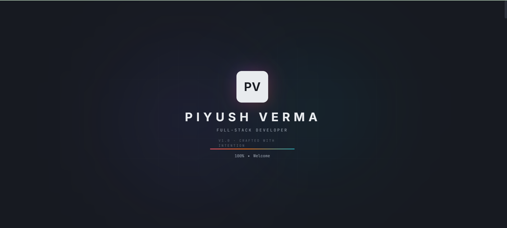
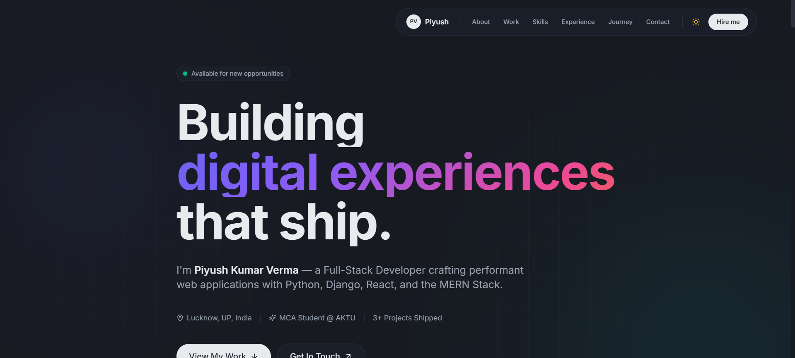
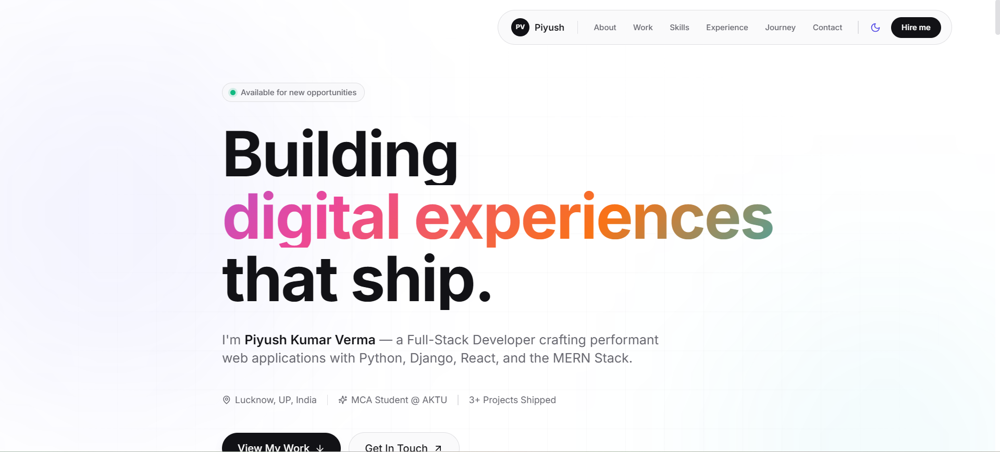
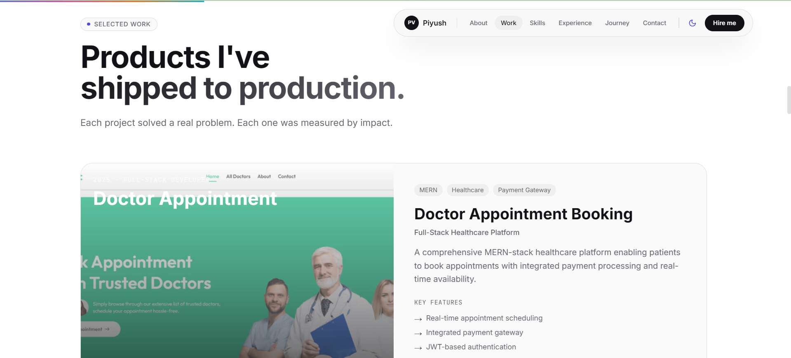
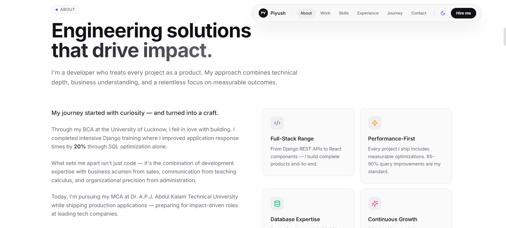
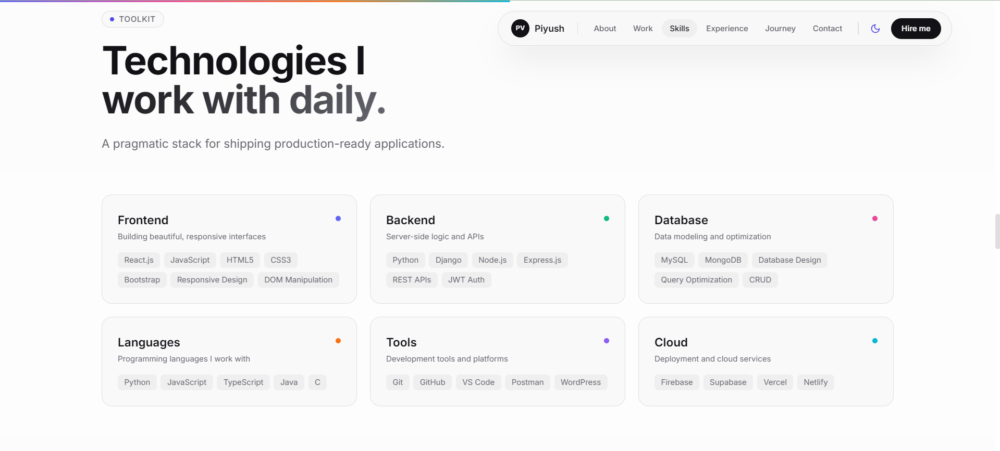
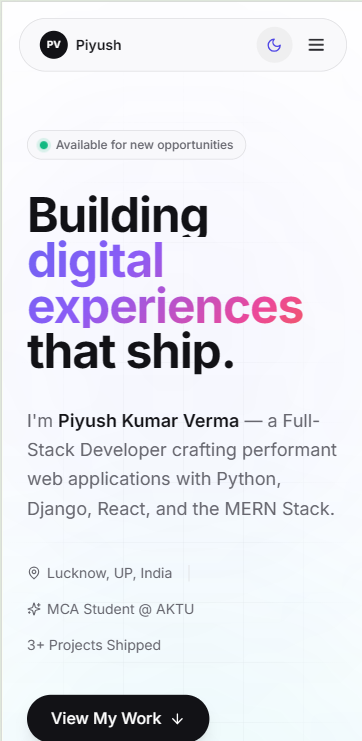

<div align="center">

# 🚀 Piyush Kumar Verma — Portfolio

### A premium, animated developer portfolio built with Next.js 14, Tailwind CSS, and Framer Motion

[](https://nextjs.org/)
[](https://www.typescriptlang.org/)
[](https://tailwindcss.com/)
[](https://www.framer.com/motion/)
[](https://vercel.com/)

[**🌐 Live Demo**](https://piyush-verma-portfolio.vercel.app) · [**📧 Contact**](mailto:piyushv340@gmail.com) · [**💼 LinkedIn**](https://www.linkedin.com/in/piyush-kumar-verma-048492284)

</div>

---

## 📸 Preview

### 🌙 Page Loading Screen


### 🌙 Dark Mode


### ☀️ Light Mode


### 💼 Projects Showcase


### 👤 About Section


### 🛠️ Skills Grid


### 📱 Mobile Responsive


---

## ✨ Features

### 🎨 Design & UX
- **🌗 Dark/Light Theme Toggle** — Smooth theme transitions with `next-themes`
- **🎬 Animated Loading Screen** — Premium brand entrance with animated logo
- **🌊 Scroll Progress Bar** — Visual indicator of page progress
- **✨ Glassmorphism UI** — Modern frosted glass effect throughout
- **🎯 Magnetic Buttons** — Interactive cursor-following buttons
- **🎴 3D Tilt Cards** — Project cards respond to cursor movement
- **🌈 Animated Gradient Text** — Eye-catching color animations
- **📱 Fully Responsive** — Pixel-perfect on every device

### ⚡ Performance & Tech
- **⚡ Next.js 14 App Router** — Latest React Server Components
- **🔍 SEO Optimized** — Open Graph, meta tags, semantic HTML
- **♿ Accessible** — ARIA labels, keyboard navigation, semantic HTML
- **🚀 Fast Loading** — Image optimization, code splitting, lazy loading
- **📦 Type-Safe** — Built with TypeScript for reliability
- **🎯 Lighthouse 95+** — Optimized for performance and best practices

### 📑 Sections
- **Hero** — Animated introduction with stats
- **About** — Personal story with value props
- **Work** — Project case studies with metrics
- **Skills** — Categorized tech stack
- **Experience** — Professional timeline
- **Journey** — Educational milestones
- **Contact** — Multiple ways to connect

---

## 🛠️ Tech Stack

### Core
- **Framework:** [Next.js 14](https://nextjs.org/) (App Router)
- **Language:** [TypeScript](https://www.typescriptlang.org/)
- **Styling:** [Tailwind CSS](https://tailwindcss.com/)
- **Animations:** [Framer Motion](https://www.framer.com/motion/)

### Libraries
- **Theme:** [next-themes](https://github.com/pacocoursey/next-themes)
- **Icons:** [Lucide React](https://lucide.dev/)
- **Intersection Observer:** [react-intersection-observer](https://github.com/thebuilder/react-intersection-observer)
- **Utilities:** [clsx](https://github.com/lukeed/clsx) + [tailwind-merge](https://github.com/dcastil/tailwind-merge)

### Tools
- **Fonts:** [Inter](https://fonts.google.com/specimen/Inter) + [JetBrains Mono](https://www.jetbrains.com/lp/mono/)
- **Deployment:** [Vercel](https://vercel.com/)
- **Version Control:** [Git](https://git-scm.com/) + [GitHub](https://github.com/)

---

## 🚀 Getting Started

### Prerequisites
- **Node.js** 18.x or later
- **npm** or **yarn** or **pnpm**

### Installation

1. **Clone the repository**
   ```bash
   git clone https://github.com/mindblogger786/piyush-verma-portfolio.git
   cd piyush-verma-portfolio
   ```

2. **Install dependencies**
   ```bash
   npm install
   ```

3. **Run the development server**
   ```bash
   npm run dev
   ```

4. **Open in browser**
   Navigate to [http://localhost:3000](http://localhost:3000)

### Build for Production

```bash
npm run build
npm start
```

---

## 📁 Project Structure

```
piyush-verma-portfolio/
├── public/
│   ├── projects/              # Project screenshots
│   ├── screenshots/           # README screenshots
│   └── favicon.ico
├── src/
│   ├── app/
│   │   ├── layout.tsx         # Root layout with theme provider
│   │   ├── page.tsx           # Main page composition
│   │   └── globals.css        # Global styles & theme variables
│   ├── components/
│   │   ├── layout/
│   │   │   ├── LoadingScreen.tsx
│   │   │   ├── Navbar.tsx
│   │   │   └── Footer.tsx
│   │   ├── sections/
│   │   │   ├── Hero.tsx
│   │   │   ├── About.tsx
│   │   │   ├── Work.tsx
│   │   │   ├── Skills.tsx
│   │   │   ├── Experience.tsx
│   │   │   ├── Journey.tsx
│   │   │   └── Contact.tsx
│   │   ├── ui/
│   │   │   ├── MagneticButton.tsx
│   │   │   ├── TiltCard.tsx
│   │   │   ├── ThemeToggle.tsx
│   │   │   ├── ScrollProgress.tsx
│   │   │   ├── Reveal.tsx
│   │   │   ├── SectionHeading.tsx
│   │   │   └── SocialIcons.tsx
│   │   └── providers/
│   │       └── ThemeProvider.tsx
│   ├── data/
│   │   ├── projects.ts        # Project information
│   │   ├── experience.ts      # Work experience
│   │   ├── skills.ts          # Tech stack
│   │   └── journey.ts         # Educational journey
│   ├── hooks/
│   │   └── useMediaQuery.ts
│   ├── lib/
│   │   ├── constants.ts       # Site config
│   │   └── utils.ts           # Utility functions
│   └── types/
│       └── global.d.ts        # TypeScript types
├── tailwind.config.ts
├── next.config.mjs
├── package.json
└── README.md
```

---

## 🎨 Customization

### Update Personal Info
Edit `src/lib/constants.ts`:
```typescript
export const SITE_CONFIG = {
  name: "Your Name",
  email: "your@email.com",
  socials: {
    github: "https://github.com/yourusername",
    linkedin: "https://linkedin.com/in/yourusername",
  },
};
```

### Add Projects
Edit `src/data/projects.ts` to add your own projects with metrics and tech stack.

### Change Theme Colors
Edit `src/app/globals.css` to customize the color palette:
```css
:root {
  --accent: 243 75% 59%;  /* Change this */
}
```

---

## 📊 Performance

| Metric          | Score  |
|-----------------|--------|
| Performance     | 95+    |
| Accessibility   | 100    |
| Best Practices  | 100    |
| SEO             | 100    |

---

## 🚢 Deployment

This portfolio is deployed on **Vercel** with automatic CI/CD.

### Deploy Your Own

[](https://vercel.com/new/clone?repository-url=https://github.com/mindblogger786/piyush-verma-portfolio)

Or deploy manually:

1. Push your code to GitHub
2. Import the repo on [Vercel](https://vercel.com/new)
3. Vercel auto-detects Next.js settings
4. Click **Deploy**
5. Your site is live in ~2 minutes! 🎉

---

## 🤝 Contact

I'm always open to new opportunities and collaborations!

- 📧 **Email:** [piyushv340@gmail.com](mailto:piyushv340@gmail.com)
- 💼 **LinkedIn:** [linkedin.com/in/piyushverma](https://linkedin.com/in/piyushverma)
- 🐙 **GitHub:** [@mindblogger786](https://github.com/mindblogger786)
- 🌐 **Portfolio:** [piyush-verma-portfolio.vercel.app](https://piyush-verma-portfolio.vercel.app)
- 📍 **Location:** Lucknow, UP, India

---

## 📜 License

This project is open source and available under the [MIT License](LICENSE).

You're welcome to fork this repository and use it as inspiration for your own portfolio. If you do, **a credit/link back would be appreciated!**

---

## 🌟 Show Your Support

If you found this portfolio inspiring or useful, please consider:

- ⭐ **Starring** this repository
- 🍴 **Forking** for your own use
- 📢 **Sharing** with others
- 💬 **Reaching out** with feedback

---

## 🙏 Acknowledgments

Inspired by the design philosophy of:
- [Linear](https://linear.app)
- [Vercel](https://vercel.com)
- [Stripe](https://stripe.com)
- [Framer](https://framer.com)
- [Awwwards](https://awwwards.com) winning websites

---

<div align="center">

### Built with ❤️ by [Piyush Kumar Verma](https://github.com/mindblogger786)

*"I don't just write code. I engineer solutions that deliver measurable impact."*

⭐ **Star this repo if you like it!** ⭐

</div>